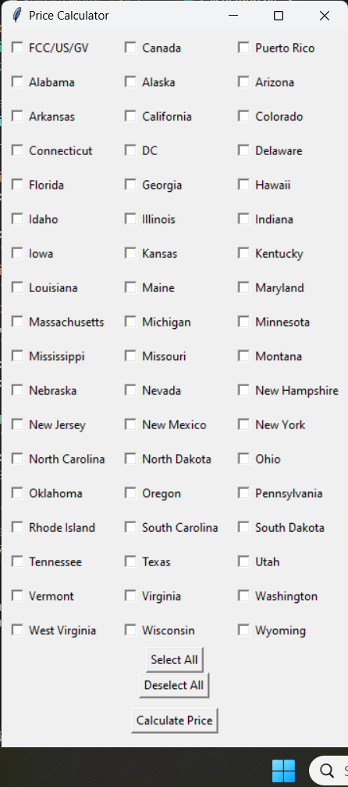
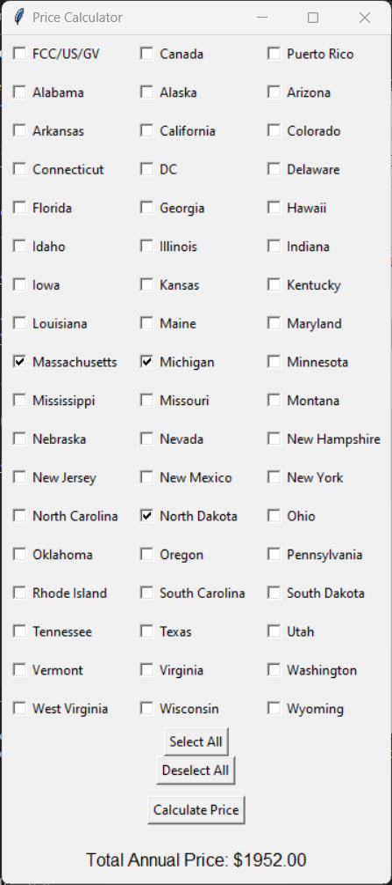

# briefing_pricing_model

The Briefing Pricing Model is a GUI application that is used to calculate the annual price of a company wishing to sign up for briefing services, which is our regualtory newsletter. 

See the image below. The application allows you to select the jurisdictions you want to track with your services. Once you have selected your jurisdictions, you would then click the Calculate Price button. 

Two smaller windows then appear, asking for the company type and number of users respectively. Selecting the company type allows you to receive news relevant to your company, with the number of users allowing you to select your amount of licenses for purchase. 

Then finally, the price of the subscription appears at the bottom of the screen. 

This product was used as a prototype, and a more robust product was delivered by our development team as a result.

